# UI_Event 项目彩色流程图

## 线路图例

- 🔵 **蓝色实线：界面与控制命令**
- 🟢 **绿色实线：事件采集和画面显示**
- 🟠 **橙色实线：EventMamba 推理**
- 🔴 **红色虚线：停止与关闭**

```mermaid
flowchart LR
    User(["用户"])

    subgraph UI["UI 进程 · Python 3.8"]
        Main["① main.py<br/>程序入口"]
        Bootstrap["② bootstrap.py<br/>配置 SDK 与 DLL"]
        Window["③ widget.py<br/>MainWindow 装配"]
        CameraUI["④ camera_ui_coordinator.py<br/>相机与回放操作"]
        InferUI["④ inference_operation_coordinator.py<br/>推理操作"]
        Controller["⑤ controller.py<br/>UI 控制门面"]
        API["⑥ backend/api.py<br/>后端统一入口"]
        Viewport["⑫ event_viewport_presenter.py<br/>显示与预测叠加"]
        Shutdown["shutdown_coordinator.py<br/>关闭协调器"]
    end

    subgraph Events["事件采集与处理"]
        CameraService["⑦ camera_service.py<br/>采集线程与生命周期"]
        Factory{"⑧ source_factory.py<br/>选择输入源"}
        Live["Metavision<br/>实时相机 / RAW"]
        H5["H5 文件"]
        AEDAT["AEDAT4 文件"]
        Pipeline["⑨ event_pipeline.py<br/>ROI · 去噪 · 时间窗口"]
        Renderer["⑩ event_frame_renderer.py<br/>事件生成图像"]
        Queue[("⑩ 推理事件队列<br/>20 ms · 1024×3")]
    end

    subgraph Comms["ZeroMQ 进程通信"]
        Client["⑪ NetworkThread.py<br/>REQ 客户端"]
        Protocol["zmq_protocol.py<br/>eventmamba/v1"]
    end

    subgraph Inference["推理进程 · Python 3.13"]
        InferService["⑦ inference_service.py<br/>推理生命周期"]
        Process["⑧ backend_process.py<br/>子进程管理"]
        WinEntry["⑨ windows_backend.py<br/>推理入口"]
        Server["⑩ inference_server.py<br/>REP 服务"]
        Predictor["⑪ windows_onnx_predictor.py<br/>ONNX Runtime CUDA"]
        Model[("EventMamba 模型<br/>center / ellipse")]
    end

    %% 蓝色：界面与控制命令
    User -->|"点击按钮"| Main
    Main --> Bootstrap
    Bootstrap --> Window
    Window --> CameraUI
    CameraUI --> Controller
    Controller --> API

    %% 绿色：事件采集和画面显示
    API -->|"启动采集"| CameraService
    CameraService --> Factory
    Factory --> Live
    Factory --> H5
    Factory --> AEDAT
    Live --> Pipeline
    H5 --> Pipeline
    AEDAT --> Pipeline
    Pipeline -->|"显示帧"| Renderer
    Renderer --> Viewport
    Viewport -->|"更新画面"| User

    %% 橙色：EventMamba 推理
    Window --> InferUI
    InferUI --> Controller
    API -->|"启动推理"| InferService
    InferService --> Process
    Process --> WinEntry
    WinEntry --> Server

    Pipeline -->|"推理事件"| Queue
    Queue --> Client
    Client -->|"请求"| Protocol
    Protocol --> Server
    Server --> Predictor
    Predictor --> Model
    Model --> Predictor
    Predictor --> Server
    Server -->|"预测结果"| Protocol
    Protocol --> Client
    Client --> Viewport

    %% 红色虚线：停止与关闭
    Window -.->|"关闭应用"| Shutdown
    Shutdown -.->|"停止采集"| CameraService
    Shutdown -.->|"停止网络与进程"| InferService

    classDef ui fill:#dbeafe,stroke:#2563eb,color:#172554,stroke-width:2px;
    classDef event fill:#dcfce7,stroke:#16a34a,color:#052e16,stroke-width:2px;
    classDef inference fill:#ffedd5,stroke:#ea580c,color:#431407,stroke-width:2px;
    classDef communication fill:#fef3c7,stroke:#d97706,color:#451a03,stroke-width:2px;
    classDef shutdown fill:#fee2e2,stroke:#dc2626,color:#450a0a,stroke-width:2px;
    classDef decision fill:#f3e8ff,stroke:#9333ea,color:#3b0764,stroke-width:2px;

    class Main,Bootstrap,Window,CameraUI,InferUI,Controller,API,Viewport ui;
    class CameraService,Live,H5,AEDAT,Pipeline,Renderer,Queue event;
    class Factory decision;
    class Client,Protocol communication;
    class InferService,Process,WinEntry,Server,Predictor,Model inference;
    class Shutdown shutdown;

    linkStyle 0,1,2,3,4,5 stroke:#2563eb,stroke-width:3px;
    linkStyle 6,7,8,9,10,11,12,13,14,15,16 stroke:#16a34a,stroke-width:3px;
    linkStyle 17,18,19,20,21,22,23,24,25,26,27,28,29,30,31,32,33 stroke:#ea580c,stroke-width:3px;
    linkStyle 34,35,36 stroke:#dc2626,stroke-width:3px,stroke-dasharray:7 5;
```

## 阅读入口

1. 从蓝色线路开始，理解用户操作如何从 `MainWindow` 到达后端 API。
2. 沿绿色线路查看事件如何从相机或文件进入 `event_pipeline.py` 并生成画面。
3. 沿橙色线路查看事件如何跨越 Python 3.8/3.13 进程边界完成推理。
4. 沿红色虚线查看应用关闭时相机线程、网络线程和推理进程的停止顺序。

`event_pipeline.py` 是数据分岔点：显示帧进入绿色线路，20 ms 推理事件窗口进入橙色线路；两条线路最终在 `event_viewport_presenter.py` 汇合。
